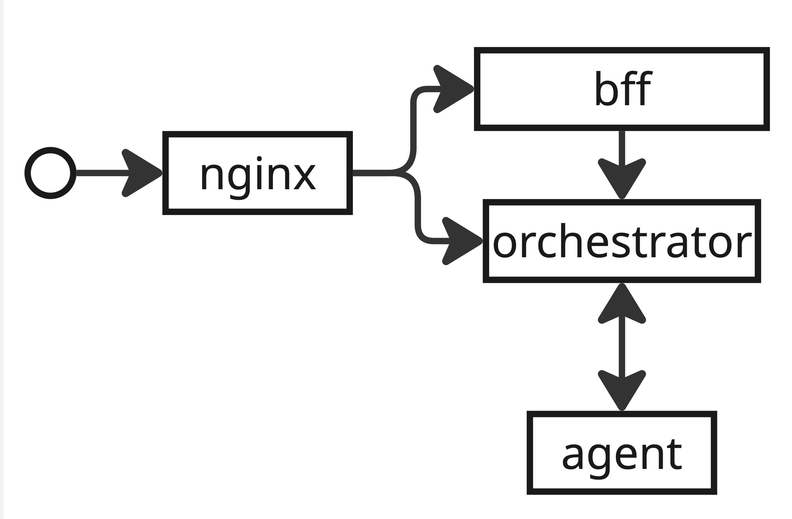

This is distributed calculator

(Or a bad Apache Spark cosplay?)

The system consists of nodes of 2 types:
- Orchestrator
- Agent

Also, the web interface is provided

# Table of Contents
1. [Getting Started](#getting-started)
   - [Requirements](#requirements)
   - [Start Up](#start-up)
     - [Command Line](#command-line)
     - [Taskfile](#taskfile)
     - [Docker CLI](#docker-cli)
     - [Docker Compose](#docker-compose)
2. [Services](#services)
   - [Scheme](#scheme)
   - [Orchestrator](#orchestrator)
   - [Agent](#agent)
   - [Frontend](#frontend)
3. [Good to Know](#good-to-know)
   - [General](#general)
   - [Expressions](#expressions)
4. [Examples of Use](#examples-of-use)
   - [/api/v1/calculate](#apiv1calculate)
   - [/api/v1/expressions](#apiv1expressions)
   - [/api/v1/expressions/{id}](#apiv1expressionsid)
5. [Future Plans](#future-plans)
  


# Getting Started

## Requirements
Before you start, you may want to have the following dependencies installed:

### Mandatory
- Go 1.23.0 and above
- NodeJS 21.0.0 and above<br/>
***Or***
- Docker 28.0.0 and above

### Optional
- Taskfile 3.41.0 and above

## Start Up
You can run application in several ways:

- [Command Line](#command-line)
- [Taskfile](#taskfile)
- [Docker CLI](#docker-cli)
- [Docker Compose](#docker-compose)

Docker Compose is advised for your convenience

### Command Line
Though it is advised to use Docker Compose to run application, you can still use console commands to run it

**Download dependencies and run application**

```shell
cd backend
go mod download
go run cmd/orchestrator/main.go & go run cmd/agent/main.go
```

**Download dependencies and run web interface**

```shell
cd frontend
export BACKEND_URL=http://localhost:8080
npm install
npm run build && npm run start
```

> **NOTICE**: `export` command only works for Linux and macOS, use `$env` for Windows instead

### Taskfile
Also, you can use Taskfile to run application with default configuration

**Run backend**

```shell
task run-backend
```

**Run web interface**

```shell
task run-frontend
```

> **NOTICE**: Taskfile initiates `export` command which is only available for Linux and macOS. No workaround for now

### Docker CLI
You can use Docker CLI to build images and then run containers

**Build orchestrator and agent**

```shell
docker build -t orchestrator:latest -f ./backend/build/package/orchestrator/Dockerfile ./backend & docker build -t agent:latest -f ./backend/build/package/agent/Dockerfile ./backend
```

**Run orchestrator and agent**

```shell
docker run -d --name orchestrator -p 8080:8080 orchestrator:latest && docker run -d --name agent --link orchestrator:orchestrator -e MASTER_URL=http://orchestrator:8080 agent:latest
```

> **NOTICE**: By default, orchestrator port `8080` is forwarded on host port `8080`

**Build web interface**

```shell
docker build -t frontend:latest --build-arg BACKEND_URL=http://orchestrator:8080 ./frontend
```

**Run web interface**

```shell
docker run -d --name frontend -p 3000:3000 --link orchestrator:orchestrator frontend:latest
```

### Docker Compose
Docker Compose is the most preferable way to run app. As mentioned in [compose file](docker-compose.yaml), on default 
the port 8080 of ***Orchestrator*** is bound on 8080 port of local machine and the port 3000 of ***Frontend*** is bound on 3000 port of local machine

**Build and run all services**

```shell
docker compose up --build
```

**Build all images**

```shell
docker compose build
```

**Run all services**

```shell
docker compose up
```

# Services

## Scheme
This scheme illustrates the way expressions are processed



**Queue**: Task queue. Currently, implemented as built-in orchestrator, later may be replaced with message bus

**Store**: Expression store. Currently, implemented as thread-safe map, later may be replaced with proper database

**Planner**: Task planner. Inner controller, responsible for task routing: it ensures that each result received from agent will be associated with the corresponding task

## Orchestrator
Orchestrator is the master node of distributed calculator

- It provides REST API for client requests
- It decomposes expressions into atomic tasks and enqueues them for agent to process

### Configuration
Orchestrator can be configured via environment variables

`HOST`: Host to run on (default: `0.0.0.0`)

> **NOTICE**: Do not change host if you run in docker, otherwise it may not work properly 

`PORT`: Port to run on (default: `8080`), must be in range between `1` and `65535`

`LOG_LEVEL`: Level of logging (default: `info`)

`TIME_ADDITION_MS`: Time in milliseconds which `+` operation takes (default: `1`), must be non-negative integer

`TIME_SUBTRACTION_MS`: Time in milliseconds which `-` operation takes (default: `1`), must be non-negative integer

`TIME_MULTIPLICATION_MS`: Time in milliseconds which `*` operation takes (default: `1`), must be non-negative integer

`TIME_DIVISION_MS`: Time in milliseconds which `/` operation takes (default: `1`), must be non-negative integer

## Agent
Agent is a slave node of distributed calculator

- It pulls tasks from orchestrator to process and sends the result back after processing
- It supports horizontal scaling via ***reverse proxy***

> **NOTICE**: On start up, agent will try to connect to orchestrator. It will exit immediately on failure after retries

### Configuration
Agent can be configured via environment variables

`LOG_LEVEL`: Level of logging (default: `info`)

`COMPUTING_POWER`: Amount of active workers per agent instance (default: `10`), must be positive integer

`BUFFER_SIZE`: Size of task buffer (default: `128`), must be positive integer

`POLL_TIMEOUT`: Polling interval in milliseconds (default: `50`), must be positive integer

`MAX_RETRIES`: Maximum retries on failed requests (default: `3`), must be positive integer

`MASTER_URL`: Orchestrator URL in `protocol://host:port` format (default: `http://localhost:8080`)

## Frontend
Frontend is a web interface for distributed calculator

### Configuration
Frontend can be configured via environment variables

`BACKEND_URL`: Backend API URL in `protocol://host:port` format

> **NOTICE**: Due to Next.js specifics, `BACKEND_URL` must be a build argument if you run in Docker

# Good to Know

## General

- Currently, the system keeps all data in-memory, that means that all data will be lost on restart
- Currently, the system is stateful, that means that data you receive depends on which node you have accessed
- It is possible to use proxy like [envoy](https://www.envoyproxy.io), 
[nginx](https://nginx.org) or 
[traefik](https://doc.traefik.io/traefik/) to balance incoming requests between running nodes
- If result of expressions has more than `8` decimal places, they are thrown away
- Notice that expressions like `2 2 + 3` will be processed as `22+3` due to the system design

## Expressions
1. During the evaluation, field `result` in Expressions schema is `0` until expression is evaluated
2. May have several statuses:
   - `pending`: the expression is being processed
   - `completed`: the expression is processed and result is ready for use
   - `failed`: the system failed to process the expression

# Examples of Use
- [API Specification](backend/api/v1/api.yaml)
- [More examples](backend/examples)

## /api/v1/calculate
Send expression to start evaluation

### Request
```http request
POST localhost:8080/api/v1/calculate
Content-Type: application/json

{
  "expression": "3*4+7"
}
```
`expression`: string

### Response
```json
{
   "id": 1996284807462067036
}
```
`id`: int 

### Example

#### Success

```shell
curl -X POST "http://localhost:8080/api/v1/calculate" \
     -H "Content-Type: application/json" \
     -d '{"expression": "2 + 2 * 2"}'
```

#### Bad Request

```shell
curl -X POST "http://localhost:8080/api/v1/calculate" \
     -H "Content-Type: application/json" \
     -d '"corrupted json"'
```

#### Unprocessable Entity

```shell
curl -X POST "http://localhost:8080/api/v1/calculate" \
     -H "Content-Type: application/json" \
     -d '{"expression": "2++3"}'
```

## /api/v1/expressions
Receive all expressions from orchestrator store
- Currently, does not support pagination, just returns all expressions kept in the store

### Request
```http request
GET http://localhost:8080/api/v1/expressions
```

### Response
```json
{
   "expressions": [
      {
         "id": 1996284807462067036,
         "status": "completed",
         "result": 19.0
      },
      {
         "id": 1798228190132811771,
         "status": "pending",
         "result": 0
      }
   ]
}
```
`id`: int

`status`: string

`result`: double

### Example

```shell
curl -X GET "http://localhost:8080/api/v1/expressions"
```

## /api/v1/expressions/{id}
Receive specific expression by id

### Request
```http request
GET http://localhost:8080/api/v1/expressions/1996284807462067036
```

### Response
```json
{
   "expression": {
      "id": 1996284807462067036, 
      "status": "completed", 
      "result": 19.0
   }
}
```
`id`: int

`status`: string

`result`: double

### Example

#### Success or not found

```shell
curl -X GET "http://localhost:8080/api/v1/expressions/1996284807462067036"
```

#### Bad Request

```shell
curl -X GET "http://localhost:8080/api/v1/expressions/invalidpath"
```

## /internal/tasks

### GET

#### Request

```http request
GET http://localhost:8080/internal/task
```

#### Response

```json
{
   "task": {
      "id": 0,
      "arg1": 3.5,
      "arg2": 2,
      "operation": "+",
      "operation_time": 0.01
   }
}
```

#### Example

##### Success or not found

```shell
curl -X GET "http://localhost:8080/internal/task"
```

### POST

#### Request

```http request
POST http://localhost:8080/internal/task
Content-Type: application/json

{
    "id": 90913132,
    "result": 0.7
}
```

#### Example

##### Success or not found

````shell
curl -X POST "http://localhost:8080/internal/tasks" \
     -H "Content-Type: application/json" \
     -d '{"id": 999913183, "result": 0.7}'
````

##### Bad Request

```shell
curl -X POST "http://localhost:8080/internal/tasks" \
     -H "Content-Type: application/json" \
     -d '"corrupted json"'
```

# Future Plans

- Implement durable task queue using message broker (RabbitMQ, NATS, Redis, etc.)
- Implement persistent data storage using database (PostgreSQL, SQLite, MySQL, etc.)
- Implement pagination
- Add proxy to increase scalability